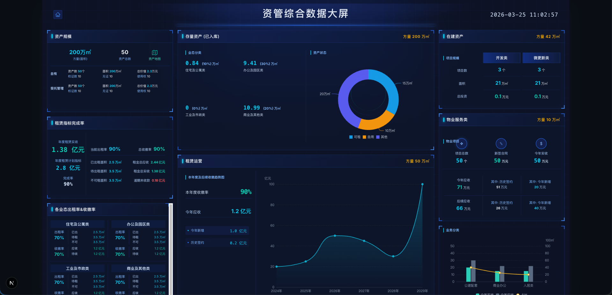

# 需求分析规划：资管综合数据大屏开辟与搭建

**日期**: 2026-03-25

## 一、 需求深度拆解

本次需求的核心目标是在现有的 SaaS 系统中（基于 Next.js App Router 架构），新增一个独立的数据大屏页面。
主要涉及以下几个方面：
1. **独立路由**：需要开辟一个全新的全屏或独立布局的路由页面（如 `/dashboard` 或 `/screen`），与普通后台内容区隔开来，避免左侧菜单和顶部导航栏的限制。
2. **大屏视图还原**：严格根据截图样式进行高度还原。大屏整体呈现蓝色的科技风格，并且需要融入当前主流的“玻璃透明效果 (Glassmorphism)” UI 设计，包含：
   - 顶部全屏头部 UI，带着标题和当前时间。
   - 左侧：资产规模（总资产/面积/价值）、租赁指标完成率、各业态出租率及收缴率。
   - 中部：存量资产及业态分类、资产状态环形图、本年度及后续收缴趋势图表。
   - 右侧：在建资产规模、物业服务类项目情况指标、业务分类对比柱状图+折线图双轴图表。
3. **图表技术栈**：严格采用 ECharts 进行图表渲染，并且必须通过给定的自定义 Hook `@/app/hooks/useEcharts.ts` 进行实例化与 options 管理。该 Hook 已经处理了对应的 ResizeObserver 和 生命周期管理，仅需传入 options 和响应式数据即可。

## 二、 步骤拆分与产品意图

### 产品意图
资产管理对于大客户来说，全局的数据可视化至关重要。「资管综合数据大屏」可作为客户企业高层进行业务视察、数据汇报以及大屏投放展示用的“驾驶舱”。设计强调空间感、数据密度和高管视角的宏观指标。

### 研发步骤拆分
- **Phase 1：基础设施与路由搭建**
  - 在 `src/app/` 下新建大屏路由文件夹，例如 `src/app/screen/page.tsx`。
  - 创建对应的大屏专属 Layout（由于是在 App Router 下，可能需要给专属页面剔除全局 Layout 中的侧边栏等影响，若 `src/app/layout.tsx` 有全局菜单影响，可通过 Route Groups `(dashboard)`、`(screen)` 或在子级覆盖等方式处理）。
- **Phase 2：大屏容器与布局开发**
  - 设计标准的 16:9 或大屏缩放容器，建议引入如 `autofit.js` 或通过 CSS `transform: scale` 的方案，保证在大屏显示器上的等比缩放响应式适配。
  - 按上、左、中、右拆分布局容器（Grid/Flex 布局）。
- **Phase 3：公共组件抽取**
  - 提取数据块卡片组件（带左侧亮条标题、背景渐变、四个角修饰及玻璃拟物态透明背景）。
  - 开发动态数字滚动组件（CountUp）。为带来更好的数字体验，指标及关键数据的展示需要增加平滑的数字跳动动画效果。
- **Phase 4：图表模块集成**
  - 利用已有的 `useEcharts.ts` 开发各模块。
  - **模块A**：资产状态分布（饼图/环形图）。
  - **模块B**：本年度及后续收缴趋势图（单线折线图，包含自定义拐点样式和 AreaStyle 渐变）。
  - **模块C**：业务分类统计图（柱状与折线混合图表，双 Y 轴结构）。
- **Phase 5：联调预留与真实假数据注入**
  - 准备贴近真实业务场景的本地 Mock 数据进行注入，确保在大屏预览时数据既丰富又具有说服力，100% 还原大屏视觉表现，同时为日后的 Dashboard API 对接预留好 props 及接口状态流转。

## 三、 盲点补充与潜在漏洞预警

1. **响应式与缩放盲点 (Resolution Scaling)**
   - 传统管理后台系统的大部分页面是响应自适应的，但“数据大屏”有其特殊性。如果简单使用百分比布局，在某些带鱼屏或非标准 16:9 比例的屏幕上图表会被拉伸变形。
   - **防范**：建议采用视口缩放（缩放父级 CSS transform wrapper），给一个基准设计稿分辨率（譬如 1920x1080），内部绝对定位或 Flex 控制。
2. **ECharts Resize 性能隐患**
   - 现有的 `useEcharts` 内使用了 `ResizeObserver`，若页面层级存在极其频繁的伸缩或动画，可能会触发过多的重绘。大屏内若包含 5 个以上的 ECharts 实例，重绘性能可能造成卡顿。
   - **防范**：在必要时，为 `resize` 方法增加防抖 (debounce)。图表内使用 `animation: true` 时，注意组件销毁重建时的内存泄漏预警（现有的 `useEffect` 清理函数已基本解决此问题）。
3. **深浅色主题模式干扰**
   - 如果当前的 SaaS 应用整体配置了亮色模式，必须确保大屏路由及其内部组件不受外层 Tailwind 或全局设定的深浅色跟随影响，强制进入纯正的暗黑模式。
4. **App Router 布局污染**
   - 因为是 `src/app` 目录结构，要确认现有的 `src/app/layout.tsx` 是否自带诸如 Header、Sidebar 等业务骨架屏。如果有，应该考虑将一般路由放到如 `src/app/(main)/` 目录下，而大屏置于 `src/app/screen/page.tsx` 并且建立独立的 `layout.tsx` 避免污染。
